# Construire son bilan matinal avec ChatGPT Work, Notion et son agenda

Un bon bilan matinal ne doit pas raconter toute votre vie numérique. Il doit répondre à une question plus étroite : qu’est-ce qui mérite votre attention avant le premier rendez-vous ?

Dans ce tutoriel, ChatGPT Work consultera deux sources : l’agenda pour les contraintes du jour et Notion pour les dossiers en cours. Il produira un brief court, sourcé et en lecture seule. Aucun message ne sera envoyé, aucune page ne sera modifiée et aucun rendez-vous ne sera déplacé.

Comptez une trentaine de minutes pour construire la première version, puis cinq minutes par jour pendant une semaine pour la corriger. Ne la planifiez qu’une fois son comportement devenu prévisible.

## Prérequis

Ce tutoriel demande un compte ChatGPT donnant accès à Work et aux plugins Notion et Google Calendar. Leur disponibilité dépend du forfait, de l’espace de travail et des réglages de l’administrateur. Un compte Google personnel et un compte Notion gratuit suffisent pour reproduire la démonstration avec des données fictives.

> [!WARNING]
> **Avant de connecter un compte professionnel**
>
> Vérifiez la politique de votre organisation et les données que vous avez le droit de transmettre à un service externe. Un prompt qui demande de « travailler en lecture seule » guide le comportement de l’agent, mais ne réduit pas techniquement les autorisations accordées au plugin. Si l’écran de connexion ne permet pas de limiter les droits, utilisez d’abord un espace de test ou un compte approuvé.

## Ce que vous allez obtenir

Le brief final tient sur un écran et contient cinq blocs :

1. les trois choses à retenir ;
2. les rendez-vous des prochaines vingt-quatre heures ;
3. les dossiers Notion liés à ces rendez-vous ou arrivant à échéance ;
4. trois décisions ou préparations au maximum ;
5. les informations manquantes et les contradictions.

Chaque élément important renvoie vers sa source. Si ChatGPT ne peut pas consulter Notion ou l’agenda, il doit le dire au lieu de compléter au hasard.

## Étape 1 — Préparer une base Notion assez simple pour être lue

L’agent ne réparera pas une base de projets devenue illisible. Commencez par une vue sobre, par exemple `Brief matinal`, qui ne contient que les sujets encore actifs.

Créez une base de données Notion avec les sept propriétés suivantes :

| Propriété | Type conseillé | Utilité dans le brief |
| --- | --- | --- |
| Projet | Titre | Nom du dossier |
| Statut | Sélection | Garder uniquement les sujets actifs ou bloqués |
| Priorité | Sélection | Distinguer 1, 2 et 3 |
| Prochaine action | Texte | Savoir ce qui peut réellement avancer |
| Échéance | Date | Faire remonter les urgences réelles |
| Blocage | Texte | Identifier ce qui demande une décision |
| Lien ou source | URL | Revenir au document d’origine |

Ajoutez ensuite une vue filtrée : `Statut` n’est pas `Terminé` et `Statut` n’est pas `Archivé`. Triez-la d’abord par priorité, puis par échéance. Chaque projet doit avoir une prochaine action compréhensible sans ouvrir cinq autres pages.

Pour le premier essai, ajoutez seulement trois projets fictifs ou non sensibles. L’un doit avoir une échéance proche, le deuxième un blocage et le troisième aucune action. Ce petit jeu de test permet de voir immédiatement si le brief trie bien l’information et signale ce qui manque.

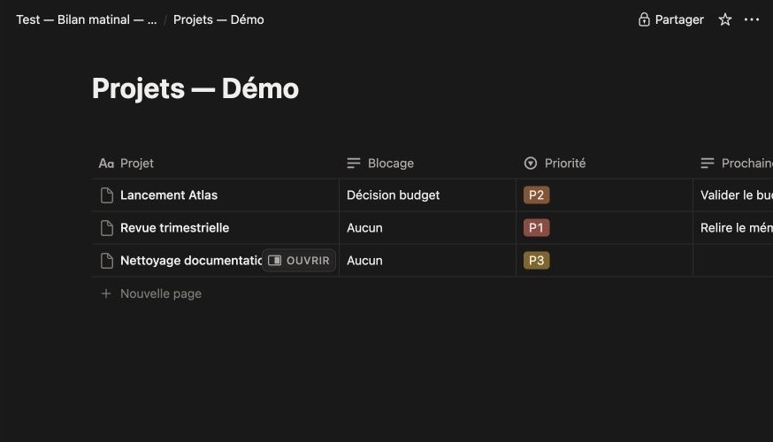

*Base de démonstration réellement utilisée : trois projets, dont un bloqué et un sans prochaine action.*

## Étape 2 — Passer dans ChatGPT Work

Ouvrez ChatGPT. En haut de l’écran, choisissez `Work` plutôt que `Chat`. Ce mode est conçu pour travailler avec des sources et des outils connectés, tout en gardant les conversations concernées dans un espace identifiable.

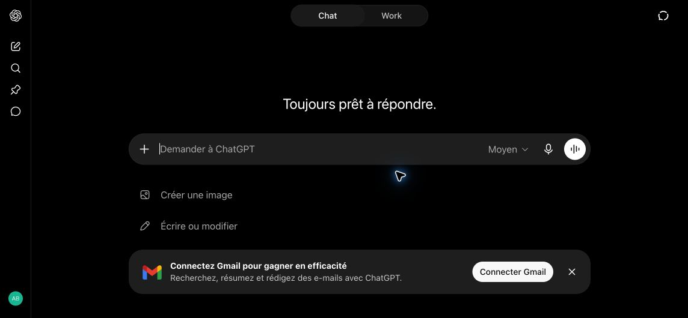

*Le sélecteur Chat/Work apparaît en haut de l’interface. Les libellés peuvent évoluer.*

Créez une nouvelle conversation réservée à cette routine et nommez-la `Bilan matinal`. Ne mélangez pas ce fil avec des demandes ponctuelles : vous pourrez ainsi relire les résultats et corriger la procédure sans perdre son historique.

## Étape 3 — Installer le plugin Notion

Dans la barre latérale, ouvrez `Plugins`, recherchez `Notion`, puis ouvrez sa fiche.

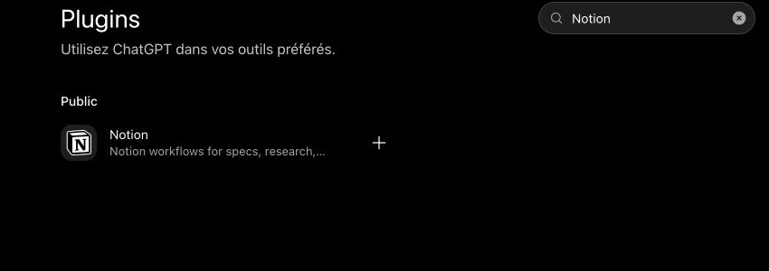

*1 — Recherchez `Notion`, puis cliquez sur le `+` à droite du résultat.*

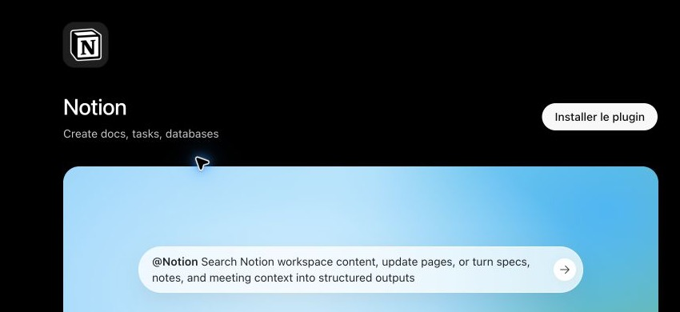

*2 — Vérifiez la fiche, puis cliquez sur `Installer le plugin`.*

Cliquez sur `Installer le plugin`, connectez le bon compte Notion et sélectionnez l’espace de travail autorisé. Lorsque Notion permet de choisir les pages accessibles, ne partagez que la base `Brief matinal` et les pages dont elle dépend.

La fiche du plugin indique qu’il peut rechercher du contenu, mais aussi mettre des pages à jour. Si votre écran d’autorisation ne propose pas de portée strictement limitée, considérez que la lecture seule repose sur votre consigne et non sur une barrière technique. Pour une première semaine, évitez donc les pages confidentielles et contrôlez chaque résultat.

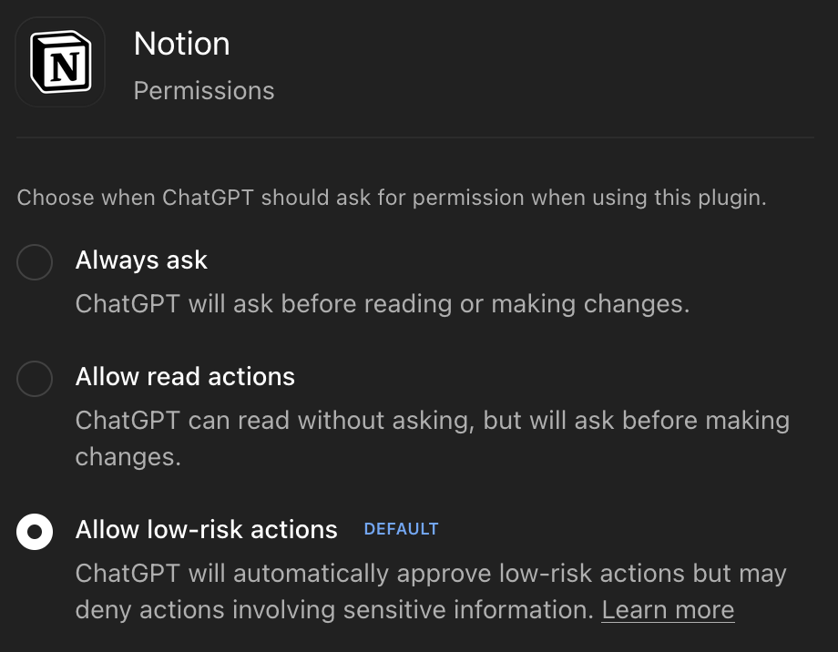

*Pour la démonstration, Notion est resté sur le réglage par défaut `Allow low-risk actions`. Avec des données professionnelles, préférez `Allow read actions` lorsqu’il est disponible.*

## Étape 4 — Installer le plugin d’agenda

Revenez dans `Plugins`, recherchez `Google Calendar`, puis ouvrez sa fiche. Le même principe s’applique si votre organisation utilise un autre agenda disponible dans votre espace ChatGPT.

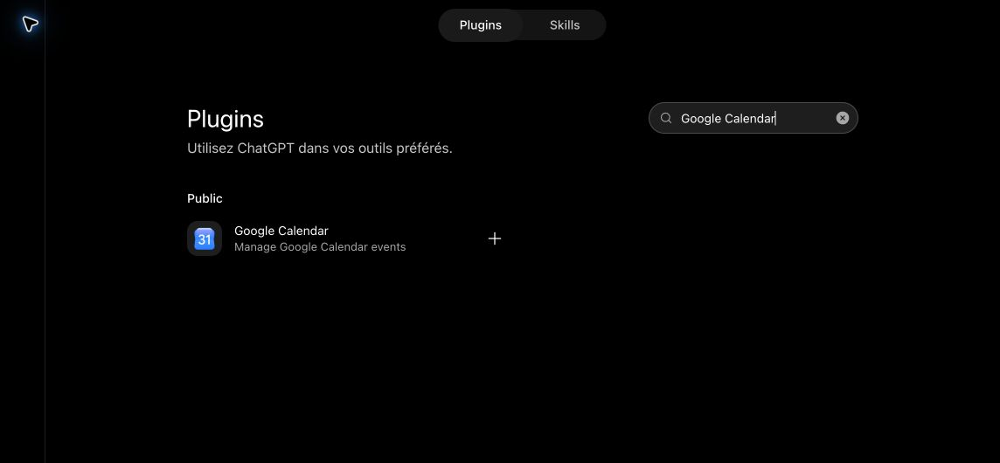

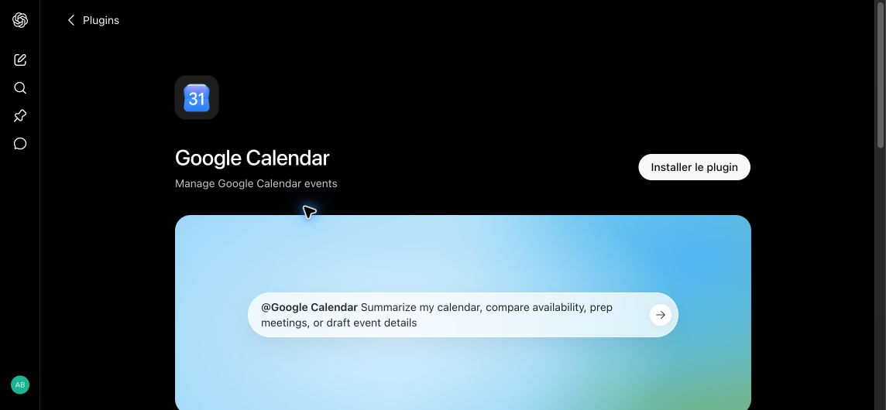

Installez le plugin et connectez le compte qui porte réellement vos rendez-vous de travail. Si vous avez plusieurs calendriers, commencez par votre calendrier principal. Vous pourrez ajouter les calendriers partagés plus tard, une fois le tri fiable.

L’interface observée lors de ce tutoriel classe Google Calendar parmi les plugins capables d’interagir et d’écrire. La règle de départ reste donc stricte : consulter les événements, jamais les créer, les déplacer, les supprimer ou inviter quelqu’un.

### Choisir le niveau d’autorisation

Pour notre essai sur des données fictives, nous avons conservé le réglage par défaut `Autoriser les actions à faible risque`. Il évite de valider chaque consultation, mais peut aussi autoriser certaines actions jugées peu risquées. Il ne constitue donc pas un mode strictement limité à la lecture.

Avec de vraies données professionnelles, choisissez plutôt `Autoriser les actions de lecture` lorsque ce réglage est proposé. ChatGPT pourra consulter les sources sans vous interrompre, mais devra demander votre accord avant une modification. Ce choix règle les validations dans ChatGPT ; il ne réduit pas nécessairement les autorisations techniques accordées au service lors de la connexion. Vérifiez ce réglage séparément pour Notion et Google Calendar.

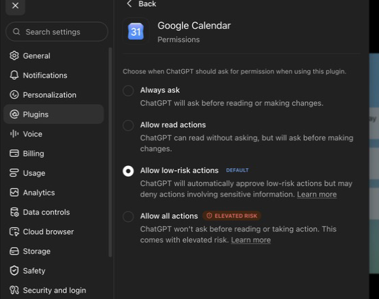

*Le même réglage doit être vérifié séparément pour Google Calendar. La capture montre les quatre niveaux proposés et le niveau réellement conservé pour le test.*

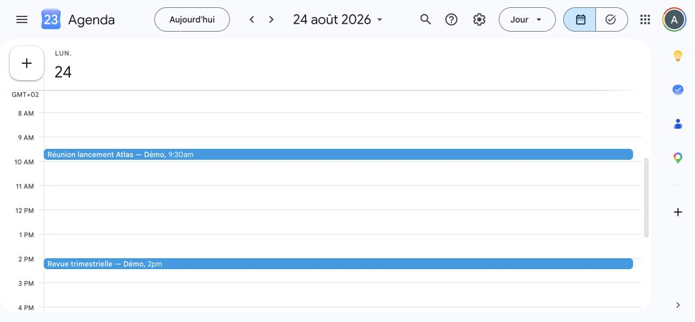

*Avant le lancement, les deux rendez-vous de démonstration apparaissent bien à 09:30 et 14:00.*

## Étape 5 — Lancer le premier bilan manuellement

Revenez dans la conversation `Bilan matinal`. Si l’interface le demande, mentionnez explicitement `@Notion` et `@Google Calendar`, puis copiez ce prompt :

```text
Tu es mon assistant de préparation quotidienne.

Travaille en lecture seule. Tu ne dois créer, modifier, déplacer ou supprimer aucun événement, aucune page, aucune tâche et aucun message. Tu ne dois contacter personne. Si une source est indisponible, dis-le clairement.

Consulte :
1. mon agenda pour les prochaines 24 heures ;
2. dans Notion, la vue « Brief matinal » et les pages directement liées aux dossiers utiles aujourd’hui.

Prépare un brief en français avec cette structure :

ÉTAT DES SOURCES
- Agenda : disponible ou indisponible
- Notion : disponible ou indisponible

À RETENIR
- Trois informations maximum qui changent réellement ma journée.

AGENDA — PROCHAINES 24 HEURES
- Heure, titre et objectif de chaque rendez-vous.
- Signale les chevauchements, les temps de trajet manquants et les réunions sans objectif clair.

DOSSIERS À PRÉPARER
- Pour chaque rendez-vous important, retrouve le projet Notion pertinent.
- Résume uniquement le contexte nécessaire, la prochaine action, l’échéance et le blocage éventuel.
- Ajoute le lien vers l’événement et vers la page Notion quand il est disponible.

DÉCISIONS OU PRÉPARATIONS
- Trois éléments maximum, formulés comme des actions concrètes.
- Ne décide pas à ma place et ne transforme pas une supposition en fait.

INFORMATIONS MANQUANTES
- Liste les documents absents, les contradictions et les éléments dont tu n’es pas certain.

Contraintes :
- Le brief doit tenir sur un écran autant que possible.
- Ignore les projets terminés ou archivés.
- N’ajoute aucun conseil générique.
- Distingue les faits confirmés, les déductions et les informations inconnues.
- Chaque affirmation importante doit renvoyer à sa source.
```

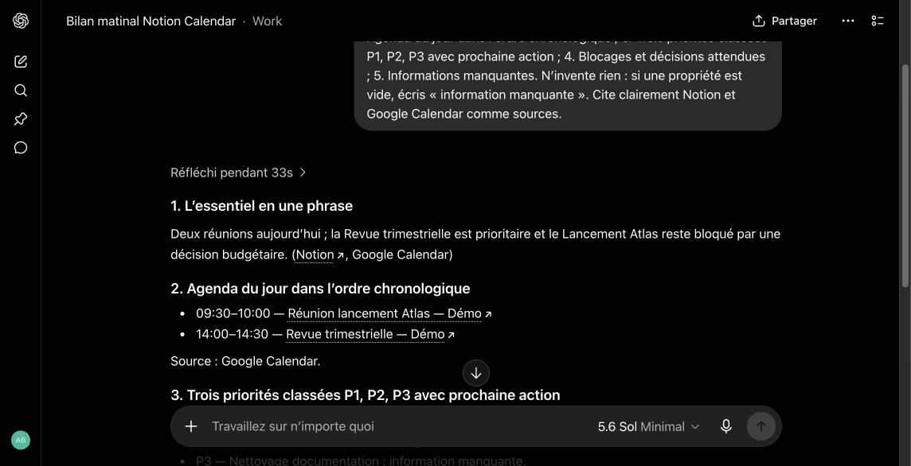

*Résultat attendu : les rendez-vous sont dans l’ordre chronologique, les dossiers sont classés P1, P2 et P3, le blocage est signalé, et les champs vides portent la mention « information manquante ».*

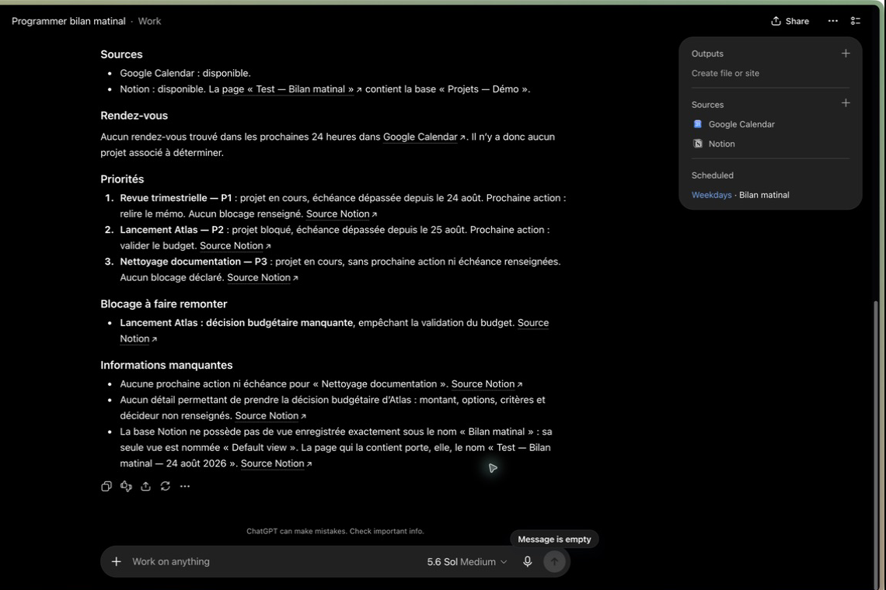

*Lors d’un second contrôle sans rendez-vous dans les vingt-quatre heures suivantes, Work l’indique au lieu d’en inventer un. La capture montre aussi les trois priorités, le blocage et la section complète des informations manquantes.*

Le premier résultat n’a pas besoin d’être élégant. Il doit être vérifiable. Ouvrez les liens cités et contrôlez au moins un rendez-vous, une échéance et un blocage dans leur source d’origine.

> [!TIP]
> **Ce que doit confirmer votre essai**
>
> Avec ce jeu de test, le brief doit ordonner les rendez-vous chronologiquement, classer les dossiers en P1, P2 et P3, signaler le blocage (par exemple un budget qui empêche d’avancer) et écrire « information manquante » lorsque la prochaine action ou un autre champ est vide.

## Étape 6 — Faire passer cinq tests au résultat

Avant de corriger le style, vérifiez le comportement :

- le brief ne contient aucun projet terminé ;
- il distingue ce qui est confirmé de ce qu’il déduit ;
- les rendez-vous et échéances renvoient à leur source ;
- il ne propose pas plus de trois préparations ;
- il indique franchement lorsqu’une source ou une information manque.

Si un test échoue, corrigez la procédure dans la même conversation. Les ajouts les plus utiles répondent à ces échecs :

| Problème observé | Consigne à ajouter |
| --- | --- |
| Le brief remonte trop de bruit | « Ne conserve que ce qui change la journée ou demande une préparation avant demain. » |
| D’anciennes tâches reviennent | « Exclus explicitement les statuts Terminé et Archivé. » |
| ChatGPT invente le lien entre une réunion et un projet | « Si le lien n’est pas explicite, écris Projet associé : inconnu. » |
| Une même information apparaît deux fois | « Fusionne les doublons et conserve les liens vers les deux sources. » |
| Une source tombe en panne sans avertissement | « Commence toujours par l’état de chaque source. » |

Répétez ce test chaque matin pendant une semaine. Notez seulement les erreurs récurrentes : une procédure trop longue pour corriger chaque exception devient vite plus fragile que le brief lui-même.

## Étape 7 — Planifier la routine

Une fois le résultat stable, vous pouvez programmer la routine depuis la conversation `Bilan matinal`. Écrivez par exemple :

> Programme ce bilan du lundi au vendredi à 7 h 30, dans le fuseau Europe/Paris, et publie chaque résultat dans cette conversation.

Avant de valider, vérifiez la consigne enregistrée, les jours, l’heure, le fuseau et la conversation de destination. Vous pouvez aussi ouvrir `Scheduled` dans la barre latérale — `Tâches planifiées` sur l’interface française observée —, choisir l’espace `Work`, puis créer la tâche manuellement.

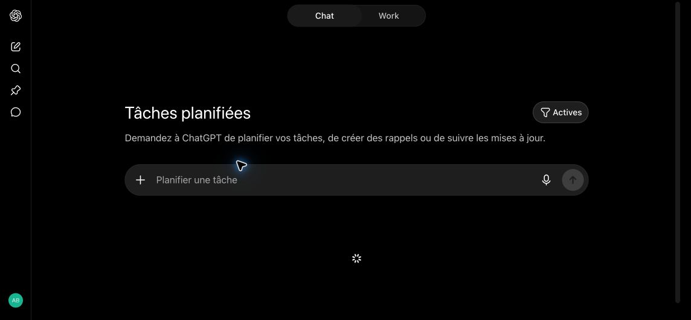

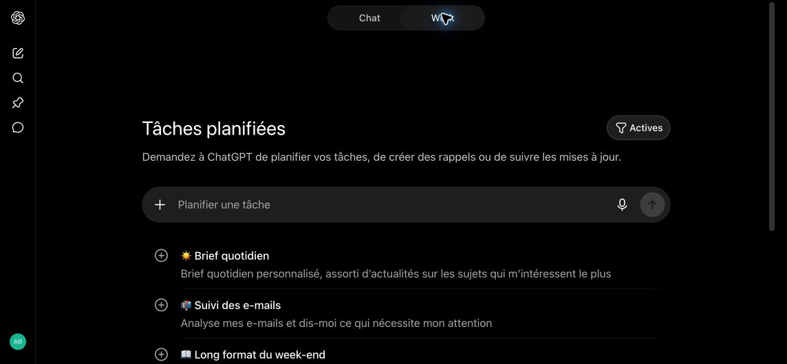

Copiez cette consigne en adaptant l’heure et le fuseau :

```text
Chaque jour ouvré à 7 h 30, heure de Paris, prépare mon bilan matinal dans Work.

Consulte Google Calendar pour les prochaines 24 heures et la vue Notion « Brief matinal ». Travaille strictement en lecture seule : ne crée, ne modifie, ne déplace et ne supprime aucun événement, aucune page ou tâche, et ne contacte personne.

Commence par indiquer si chaque source est disponible. Donne ensuite :
1. trois informations maximum qui changent réellement ma journée ;
2. mes rendez-vous avec leur heure, leur objectif et leur lien ;
3. les dossiers Notion utiles, avec prochaine action, échéance, blocage et lien ;
4. trois décisions ou préparations maximum ;
5. les informations manquantes et les contradictions.

Distingue les faits confirmés, les déductions et les informations inconnues. Ignore les projets terminés ou archivés. N’ajoute aucun conseil générique. Si rien d’important n’a changé, écris simplement « Aucun changement important depuis le dernier bilan ».
```

Vérifiez ensuite l’heure, le fuseau, les jours d’exécution et l’espace sélectionné. Les tâches hébergées sur le web peuvent s’exécuter en arrière-plan, y compris lorsque votre ordinateur est éteint. Une tâche qui dépend de fichiers locaux ou d’une application de bureau exige en revanche que la machine et l’application restent disponibles.

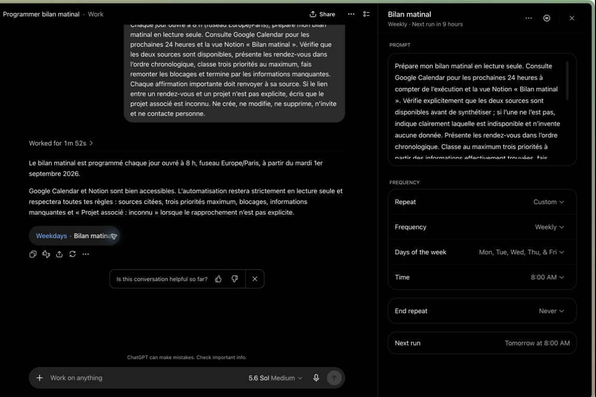

*Dans notre essai, la tâche `Bilan matinal` est programmée du lundi au vendredi à 8 h. Le panneau permet de relire la consigne, les jours, l’heure et la prochaine exécution avant de laisser la routine fonctionner seule.*

Contrôlez les trois premières exécutions planifiées comme s’il s’agissait encore de tests. Vous pouvez consulter les tâches actives, suspendues ou terminées et leurs exécutions récentes depuis l’écran `Scheduled`.

Si une erreur vient de la source — une échéance fausse ou une priorité obsolète, par exemple — corrigez Notion ou Google Calendar. Si elle vient du comportement de l’agent, décrivez précisément le cas dans la conversation et demandez à ChatGPT de mettre à jour la tâche enregistrée. Par exemple : « Ce rapprochement n’est pas justifié. Modifie la tâche pour n’associer un rendez-vous à un projet que si son nom apparaît explicitement dans l’agenda ou dans Notion. »

## Étape 8 — Utiliser le brief sans lui céder la journée

Le matin, ne demandez pas immédiatement un second résumé du résumé. Ouvrez les deux ou trois sources qui soutiennent les éléments les plus importants, choisissez la préparation qui change réellement votre journée, puis fermez le brief.

L’agent peut retrouver, trier et présenter. Il ne sait pas quelle conversation difficile vous repoussez, quel compromis votre équipe peut accepter ou quelle décision mérite d’attendre. Le bilan est réussi lorsqu’il réduit le temps de préparation sans déplacer votre responsabilité.

Une fois par semaine, relisez les erreurs : informations manquantes, faux positifs, projets mal tenus dans Notion. Corrigez d’abord la source, puis la procédure. Changer de modèle ne devrait venir qu’après.

## Couper proprement le système

Si le bilan devient bruyant ou si vos règles de sécurité changent, suspendez la tâche depuis `Planification`. Déconnectez ensuite Notion ou l’agenda dans les réglages des plugins si l’accès n’est plus nécessaire. Enfin, vérifiez dans les services concernés que l’autorisation a bien été révoquée.

Cette réversibilité fait partie du montage. Un assistant personnel utile doit pouvoir être arrêté aussi facilement qu’il a été installé.

## Sources utiles

- [Prise en main de ChatGPT Work](https://learn.chatgpt.com/docs/get-started-with-work)
- [Tâches programmées dans ChatGPT](https://learn.chatgpt.com/docs/automations)
- [Formules donnant accès à ChatGPT Work](https://learn.chatgpt.com/docs/pricing)
- [Google Calendar](https://workspace.google.com/products/calendar/)
- [Tarifs et formule gratuite de Notion](https://www.notion.com/pricing)

> [!NOTE]
> **Interface observée**
>
> Captures réalisées les 23 et 31 août 2026 sur une interface ChatGPT en français. Les noms, écrans, plugins disponibles et réglages dépendent du forfait, de l’espace de travail et des décisions de l’administrateur.
