# Faire sa première application métier avec l'IA

Ce tutoriel sert à apprendre le geste, pas à brancher une IA sur vos vraies données.

On va créer une petite application locale de gestion de stock à partir d'un fichier Excel fictif. Elle permettra d'importer le fichier, d'afficher les produits, de repérer les ruptures probables, d'identifier les stocks dormants et de produire une synthèse visuelle.

Le principe est simple : on commence dans un dossier local, avec un fichier de test, sans connecteur, sans automatisation et sans donnée client réelle.

Fichier fourni pour l'exercice : [`stock_fictif_codex.xlsx`](./stock_fictif_codex.xlsx)

## 1. Télécharger Codex

Allez sur la page officielle : [chatgpt.com/fr-FR/codex](https://chatgpt.com/fr-FR/codex/)

Téléchargez l'application Codex pour votre ordinateur, installez-la, puis connectez-vous avec votre compte ChatGPT.

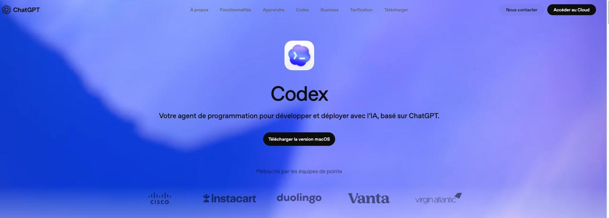

Selon votre abonnement, les limites d'usage ne seront pas les mêmes. Pour ce tutoriel, ce n'est pas grave : on ne cherche pas à lancer un agent pendant huit heures. On veut faire un premier prototype court, local et compréhensible.

## 2. Comprendre l'interface

Quand Codex s'ouvre, vous arrivez sur une interface proche de ChatGPT, mais pensée pour travailler sur des fichiers.

Dans la colonne de gauche, vous verrez notamment :

- **Nouveau clavardage** : pour lancer une nouvelle discussion avec Codex.
- **Recherche** : pour retrouver un ancien échange.
- **Modules d'extension** : pour connecter des outils externes. On n'y touche pas dans ce tutoriel.
- **Automatisations** : pour programmer des tâches. On n'y touche pas non plus.
- **Projets** : pour travailler dans un dossier précis, avec un historique séparé.
- **Paramètres** : pour régler le mode de travail et les autorisations.

Le point important : Codex n'est pas seulement une fenêtre de chat. Il peut lire, créer et modifier des fichiers dans le dossier de travail que vous lui donnez.

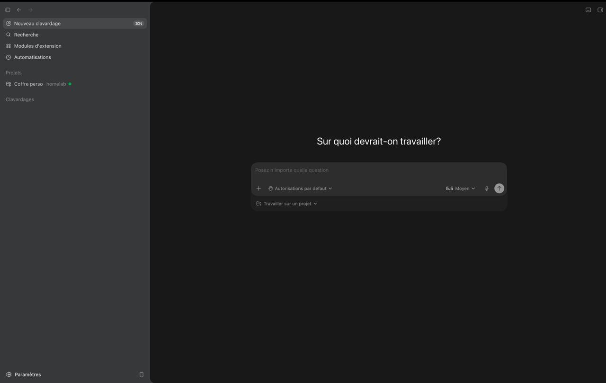

## 3. Régler Codex pour commencer

Pour un premier essai, restez simple.

Dans les paramètres :

- choisissez le mode **Pour le travail quotidien** si Codex vous le propose ;
- gardez les **autorisations par défaut** ;
- utilisez un modèle en mode moyen, par exemple **5.5 Moyen**, largement suffisant pour ce type de prototype ;
- ne connectez pas Gmail, Google Drive, Slack, Notion, ERP ou CRM ;
- ne créez pas d'automatisation.

La règle de départ : Codex travaille dans un dossier local, sur des données fictives, et rien ne sort vers un outil métier.

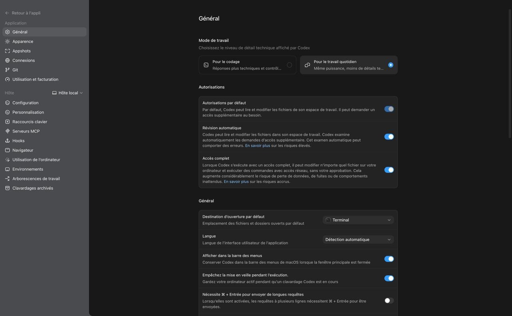

## 4. Créer le projet local

Dans la colonne de gauche, créez un nouveau projet.

Nom conseillé :

```text
Faire son APP avec l'IA
```

Associez ce projet à un dossier vide sur votre ordinateur. Par exemple :

```text
Documents/Faire son APP avec l'IA
```

Pour retrouver ce dossier ensuite, cliquez sur les trois points `...` à côté du projet dans Codex, puis choisissez **Afficher dans le Finder** sur Mac, ou l'option équivalente pour afficher le dossier sur Windows.

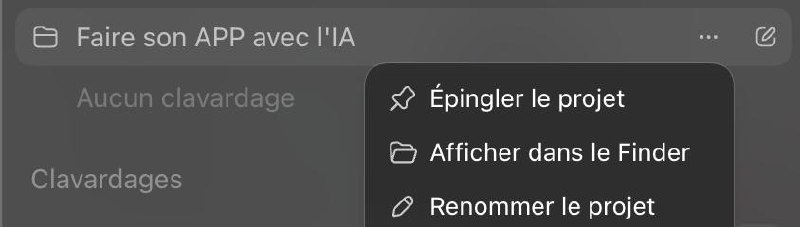

Copiez ensuite le fichier [`stock_fictif_codex.xlsx`](./stock_fictif_codex.xlsx) dans ce dossier.

Ce fichier contient uniquement des données fictives : produits, catégories, stock actuel, stock minimum, ventes sur 7 jours, délai de réapprovisionnement, fournisseur et commentaire.


## 5. Premier prompt dans Codex

Dans Codex, sélectionnez le projet **Faire son APP avec l'IA**, puis envoyez ce prompt.

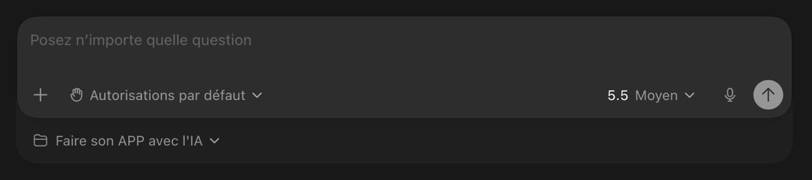

```text
Je veux créer une petite application locale de gestion de stock à partir d'un fichier Excel.

Contrainte technique importante :
je veux une application 100% navigateur, sans backend Python, sans serveur local obligatoire et sans base de données.

L'application doit fonctionner avec des fichiers HTML, CSS et JavaScript que je peux partager à un collègue. L'objectif est qu'il puisse ouvrir le fichier index.html dans son navigateur, importer le fichier Excel fictif, et tester l'application sans installer Python ni lancer de serveur.

Si une librairie JavaScript est nécessaire pour lire le fichier Excel, propose-la, explique son rôle, et privilégie une version locale dans le dossier du projet plutôt qu'un appel CDN.

Avant de créer quoi que ce soit, commence par :
1. me demander de fournir mon fichier Excel, ou me proposer de générer un fichier Excel fictif si je n'en ai pas ;
2. analyser la structure attendue du fichier Excel : colonnes nécessaires, exemples de lignes, types de données ;
3. proposer l'architecture du projet sans encore créer les fichiers ;
4. proposer les règles métier simples pour :
   - repérer les ruptures probables ;
   - repérer les stocks dormants ;
   - calculer les priorités de réapprovisionnement ;
   - produire une synthèse simple ;
5. proposer les trois maquettes fonctionnelles de pages ;
6. me donner des prompts GPT Image pour visualiser chaque page ;
7. intégrer l'identité visuelle inspirée de l'image de branding fournie :
   - fond violet profond ;
   - accents orange vif ;
   - touches blanc cassé ;
   - bouton ou badge jaune doré ;
   - style énergique, éditorial, singulier ;
   - logo/nom "Les électrons libres" visible dans l'en-tête ;
   - interface lisible et professionnelle malgré le branding expressif ;
8. attendre ma validation avant de coder.

Objectif :
- importer un fichier Excel ;
- afficher les produits ;
- repérer les ruptures probables ;
- repérer les stocks dormants ;
- afficher les priorités de réapprovisionnement ;
- montrer une synthèse simple.

Contraintes :
- ne pas utiliser de vraies données sans mon accord ;
- ne pas envoyer d'e-mail ;
- ne pas se connecter à un ERP, CRM ou outil externe ;
- ne modifier aucun fichier Excel original ;
- ne créer aucun backend ;
- ne pas utiliser Python ;
- ne pas créer de serveur local obligatoire ;
- ne pas créer de base de données ;
- garder le traitement du fichier Excel dans le navigateur ;
- créer une application locale simple ;
- documenter comment relancer le projet ;
- expliquer les limites du prototype.

Je veux trois pages :
1. Tableau de stock ;
2. Alertes et priorités ;
3. Synthèse visuelle.

Important :
Ne crée aucun fichier et n'écris aucun code tant que je n'ai pas validé l'architecture, les maquettes, le format Excel et les règles métier.
```

Ce prompt force Codex à ralentir. C'est volontaire. Avant de coder, il doit expliquer le fichier, les règles métier, les pages et l'architecture.

## 6. Créer les maquettes avec GPT Image

Dans votre projet, ouvrez une nouvelle discussion en cliquant sur l'icône crayon à droite du nom du projet. Sur l'image ci-dessous, le projet s'appelle **Faire son APP avec l'IA** : les trois points servent aux options du projet, et le crayon tout à droite sert à démarrer un nouveau clavardage dans ce projet.

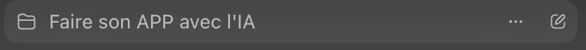

Joignez votre image de branding si vous en avez une, puis générez trois maquettes avec les prompts ci-dessous.

Astuce : si vous avez déjà une identité visuelle, envoyez une capture d'écran dans la nouvelle discussion et demandez à l'IA de s'en inspirer. Dans notre cas, nous avons utilisé une capture du bandeau **Les électrons libres** comme point de départ pour les couleurs, l'ambiance et le style de l'application.


Si vous adaptez l'exercice avec un autre fichier ou une autre identité visuelle, demandez d'abord à Codex de préparer les prompts d'image à partir de votre structure de pages et de vos données fictives.

### Page 1 : Tableau de stock

```text
Créer une image de maquette web UI pour une application locale de gestion de stock, page "Tableau de stock".

Intégrer le branding "Les électrons libres" inspiré de l'image fournie : fond violet profond, texte blanc cassé, accents orange vif, bouton jaune doré, style éditorial énergique et singulier. Logo ou nom "Les électrons libres" visible dans l'en-tête à gauche. Conserver une interface professionnelle, lisible et exploitable.

La page doit montrer :
- un en-tête violet avec le logo/nom ;
- un bouton jaune doré "Importer Excel" ;
- une navigation avec trois onglets : Tableau de stock, Alertes et priorités, Synthèse visuelle ;
- un grand tableau de produits fictifs avec colonnes Référence, Produit, Catégorie, Stock actuel, Stock minimum, Ventes 30 jours, Couverture estimée, Statut ;
- des badges orange, rouge et violet pour les statuts ;
- une barre de recherche ou filtre.

Style : outil métier local, moderne, dense mais clair, aucune donnée réelle, uniquement données fictives.
```

### Page 2 : Alertes et priorités

```text
Créer une image de maquette web UI pour une application locale de gestion de stock, page "Alertes et priorités".

Utiliser le branding "Les électrons libres" inspiré de l'image fournie : fond violet profond, blanc cassé, orange vif, jaune doré, typographie expressive pour les titres, interface professionnelle pour les données.

La page doit montrer :
- en-tête avec logo/nom "Les électrons libres" ;
- onglet "Alertes et priorités" actif ;
- section "Réapprovisionnement urgent" avec cartes produits fictifs ;
- score de priorité, quantité recommandée, délai estimé ;
- section "Stocks dormants" avec produits peu vendus, jours sans vente, valeur immobilisée ;
- badges "Urgent", "À surveiller", "Stock dormant" ;
- hiérarchie visuelle claire avec accents orange et jaune.

Style : tableau de bord opérationnel, énergique mais lisible, pas de connexion externe, pas de vraies données.
```

### Page 3 : Synthèse visuelle

```text
Créer une image de maquette web UI pour une application locale de gestion de stock, page "Synthèse visuelle".

Respecter le branding "Les électrons libres" inspiré de l'image fournie : violet profond dominant, accents orange vif, blanc cassé, jaune doré pour les actions ou KPI importants. Le logo/nom "Les électrons libres" doit apparaître dans l'en-tête.

La page doit montrer :
- cartes KPI : Produits, Ruptures probables, Stocks dormants, Valeur stock fictive ;
- graphique en barres par catégorie ;
- graphique circulaire ou anneau des statuts ;
- bloc de synthèse simple avec priorités d'action ;
- données fictives uniquement ;
- design local app, professionnel, lisible, avec personnalité éditoriale.

Éviter l'aspect SaaS générique froid. Faire une interface métier claire mais avec une identité visuelle forte.
```

Gardez les trois images générées. Vous pouvez les glisser dans Codex ou lui décrire précisément ce que vous voulez reprendre.

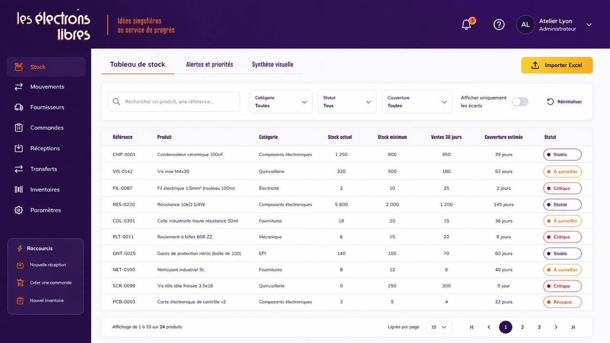

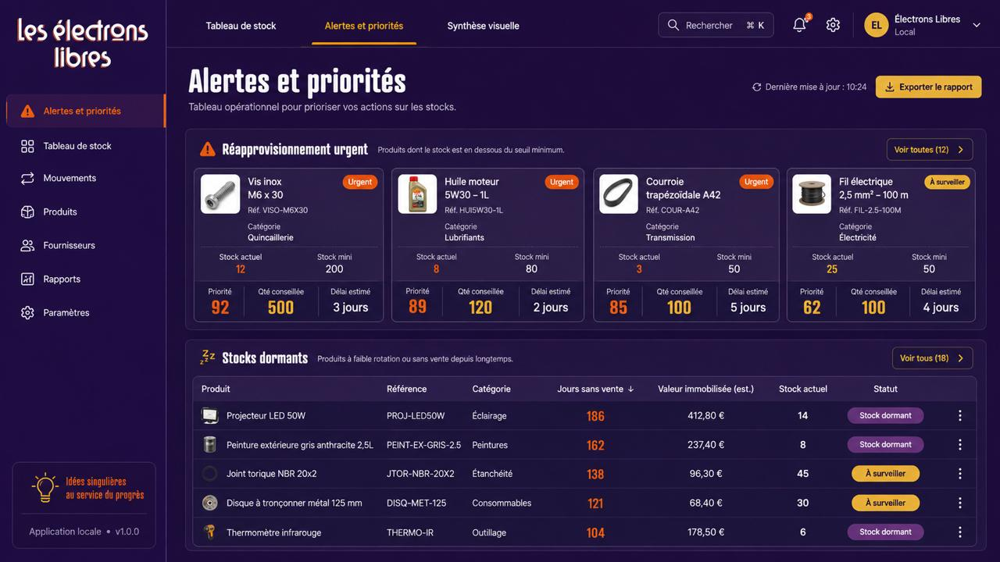

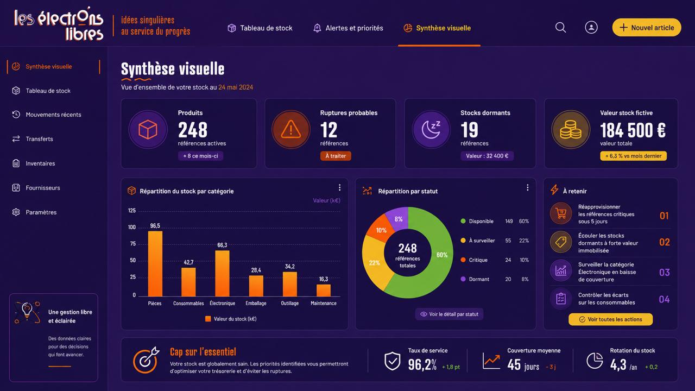

## 7. Valider, puis seulement coder

Quand Codex vous a proposé l'architecture, les règles métier et les trois pages, relisez.

Vérifiez surtout :

- les colonnes attendues dans le fichier Excel ;
- la règle de rupture probable ;
- la règle de stock dormant ;
- le calcul de priorité de réapprovisionnement ;
- les fichiers que Codex veut créer ;
- la façon de lancer l'application.

Si cela vous convient, envoyez :

```text
Je valide l'architecture, les règles métier, le format Excel et les trois pages.

Tu peux maintenant créer l'application locale.

Contraintes :
- créer une application 100% navigateur, en HTML, CSS et JavaScript ;
- ne pas utiliser Python ;
- ne créer aucun backend ;
- ne pas créer de serveur local obligatoire ;
- ne pas créer de base de données ;
- le fichier Excel original doit rester intact ;
- l'application doit fonctionner localement ;
- aucune connexion externe ;
- aucune action automatique ;
- crée un court README avec la méthode pour relancer l'application ;
- ajoute des données d'exemple seulement si le fichier Excel n'est pas encore importé.

Une fois terminé, explique-moi comment lancer l'application.
```

Dans notre essai, Codex a créé une application simple qui fonctionne directement dans le navigateur, avec un fichier `index.html`, un fichier `app.js` et un fichier `styles.css`.

## 8. Lancer l'application

Quand Codex a fini, il peut vous donner une commande de ce type :

```text
cd "/Users/macbook/Documents/Faire son APP avec l'IA"
open index.html
```

Vous pouvez la lancer dans votre terminal si vous êtes à l'aise avec ce type de commande.

Mais le plus simple est de demander directement à Codex :

```text
Lance l'application.
```

Une page devrait alors s'ouvrir directement dans votre navigateur.

Importez le fichier `stock_fictif_codex.xlsx`, puis testez les trois pages :

- Tableau de stock ;
- Alertes et priorités ;
- Synthèse visuelle.

Page **Alertes et priorités** après import du fichier Excel :

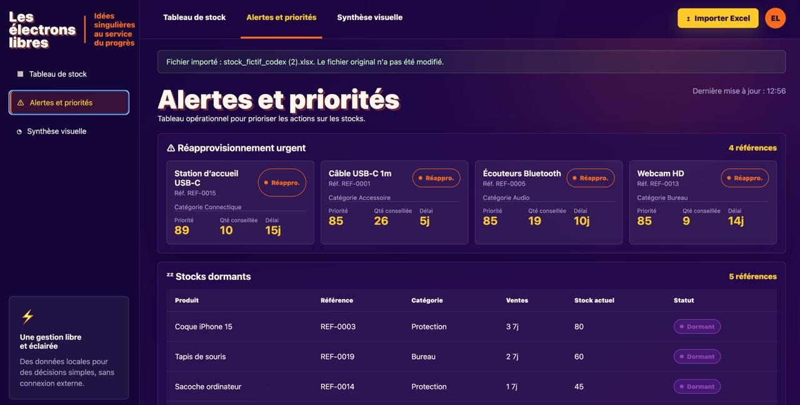

Page **Synthèse visuelle** après import du fichier Excel :

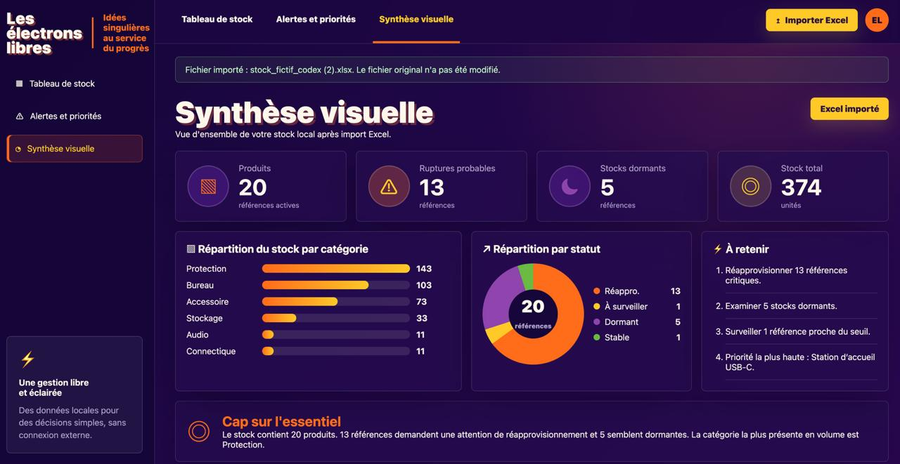

## 9. Modifier visuellement l'application

Ne cherchez pas à corriger le code vous-même si vous débutez. Décrivez ce que vous voyez.

Pour une correction précise, utilisez la fonction **Annotation** de Codex. Demandez d'abord à Codex de lancer le live preview de l'application. Il peut créer temporairement ce qu'il faut pour vous donner un lien local, par exemple :

```text
http://localhost:4173
```

Cliquez sur ce lien : l'application s'ouvre dans Codex. Cliquez ensuite sur **Annotation**, puis sélectionnez directement la zone à modifier dans l'interface.

Nous vous conseillons de rester dans le live preview de Codex pour cette étape. Tout est au même endroit : l'adresse locale, le bouton de rafraîchissement et le bouton **Annotation**. Si vous ouvrez l'application dans votre navigateur habituel, vous pouvez aussi rafraîchir avec `Cmd + Shift + R` sur Mac ou `Ctrl + Shift + R` sur Windows, mais le live preview reste le plus simple pour annoter précisément un élément.

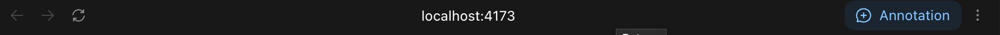

Dans notre cas, nous avons cliqué sur le bloc **Répartition par statut** de la page **Synthèse visuelle** pour demander à Codex de remplacer le camembert par un histogramme. C'est l'intérêt de l'annotation : Codex comprend précisément quelle zone modifier et peut itérer sur cet élément sans toucher au reste de l'application.

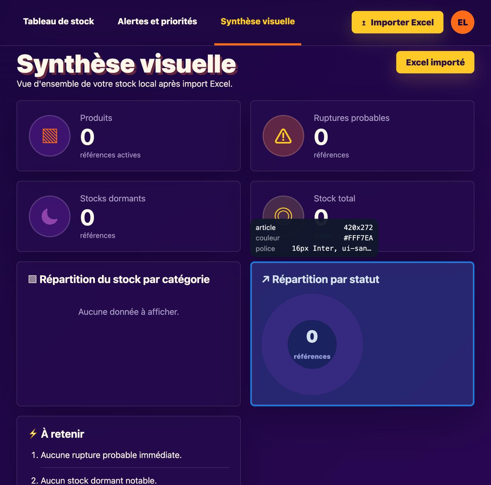

Prompt utilisé :

```text
Dans la page "Synthèse visuelle", le graphique circulaire ne me convient pas.

Remplace-le par un histogramme horizontal par statut.

Je veux :
- une barre par statut ;
- le nombre de produits à droite ;
- les couleurs du branding ;
- une lecture plus claire que le camembert.

Ne change pas la logique de calcul. Modifie seulement l'affichage.
```

Rechargez la page, vérifiez, puis recommencez si nécessaire.

Voici le résultat après modification : dans la page **Synthèse visuelle**, le camembert a été remplacé par un histogramme horizontal, plus lisible pour comparer les statuts.

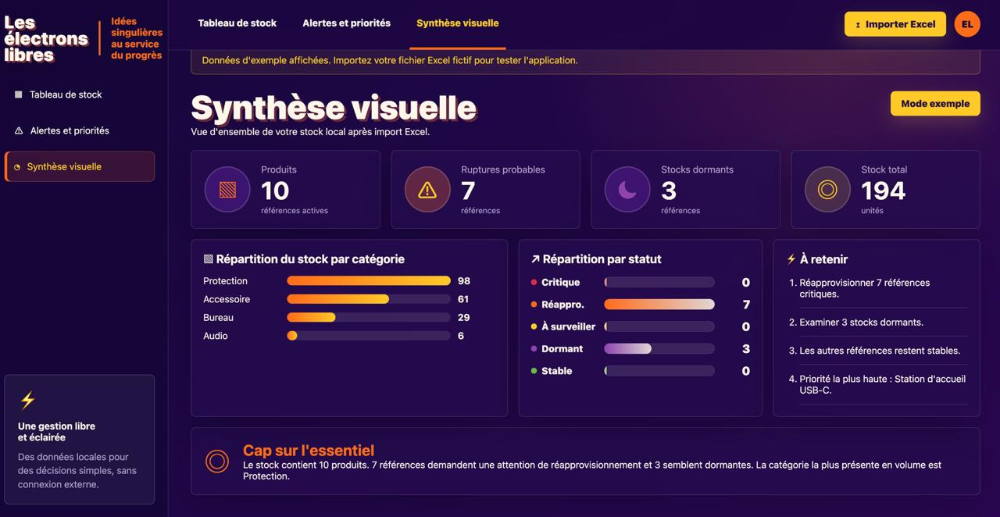

Ce passage est important : on apprend à piloter l'IA par correction précise, pas par "fais plus beau".

## 10. Vérifier où vont les données

Avant d'aller plus loin, posez la question que beaucoup oublient.

```text
Explique-moi où les données sont stockées dans cette application.

Je veux savoir :
- si le fichier Excel est seulement lu ou copié ;
- si une base de données est créée ;
- où elle se trouve ;
- comment supprimer les données de test ;
- quels fichiers contiennent la logique de calcul ;
- quelles limites il faut connaître avant d'utiliser de vraies données.
```

Vous devez comprendre la réponse. Si Codex emploie un terme flou, demandez-lui de reformuler.

Exemple :

```text
Explique-moi ça comme à une personne non développeuse.
Donne-moi les noms exacts des fichiers concernés.
```

## 11. Ajouter une section de nettoyage

Un prototype utile doit aussi savoir oublier ses données de test.

Demandez :

```text
Ajoute une page ou une section qui permet de voir les données importées et de supprimer toutes les données de test.

Je veux :
- voir le nom du fichier importé ;
- voir le nombre de lignes chargées ;
- savoir si les données sont en mémoire, dans un fichier ou dans une base locale ;
- avoir un bouton "Supprimer les données de test" ;
- afficher un message clair après suppression.

Ne supprime jamais le fichier Excel original.
```

Testez ensuite le bouton avec le fichier fictif.

Une fois les données de test supprimées, l'application revient à un état vide. Vous pouvez alors importer un nouveau fichier Excel, à condition qu'il respecte bien le format attendu : mêmes colonnes, mêmes types de données, et aucune donnée réelle sans validation.

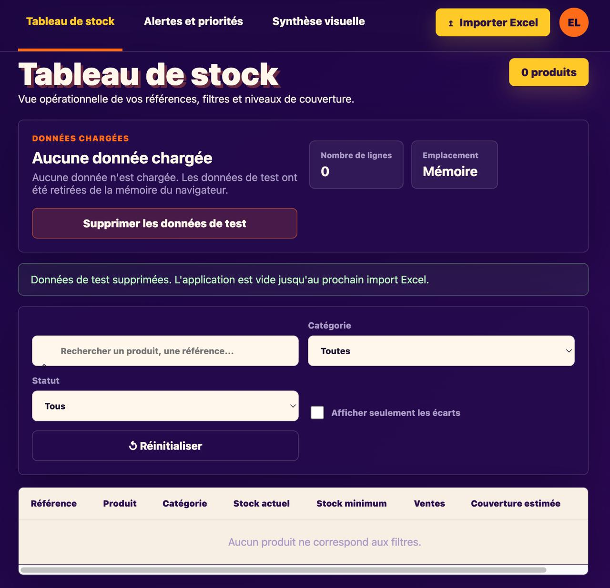

## 12. Créer le fichier LIMITES.md

Un prototype sans limites écrites devient vite dangereux, parce que tout le monde finit par oublier ce qu'il ne sait pas faire.

Demandez à Codex :

```text
Crée aussi un fichier LIMITES.md avec :
- ce que le prototype sait faire ;
- ce qu'il ne sait pas faire ;
- les hypothèses utilisées ;
- les risques avant utilisation avec de vraies données ;
- les questions à poser à l'IT.
```

Relisez ce fichier. Il doit être compréhensible par une personne métier et par une personne IT.

## 13. Garder une trace propre

Une fois le prototype fonctionnel, gardez une trace simple.

Pour ce premier exercice, nous vous conseillons surtout de conserver le dossier sur votre ordinateur et d'en faire une archive `.zip`. C'est le plus facile pour partager le prototype avec un collègue ou en discuter avec le service informatique.

Pour aller plus loin, vous pourrez aussi l'héberger sur GitHub. C'est un outil intéressant pour collaborer, partager une application et garder l'historique des modifications. Vous en voyez déjà un exemple ici : ce tutoriel et les fichiers associés sont eux-mêmes disponibles sur GitHub.

Les électrons libres reviendront sur ce sujet dans un prochain encart dédié à GitHub, au suivi d'une application et au travail à plusieurs.

Pour l'instant, l'objectif reste plus simple : garder un dossier propre, compréhensible et facile à transmettre.

## 14. Poser les questions Shadow IT

À ce stade, vous avez une petite application utile. Elle n'est pas encore prête pour l'entreprise.

Demandez à Codex :

```text
À partir de ce prototype, prépare-moi :

1. les 5 questions Shadow IT à poser avant d'utiliser de vraies données ;
2. un message court à envoyer à l'IT ou à une personne technique pour demander une revue ;
3. la liste des points qui doivent être validés avant un usage réel.

Ton :
- clair ;
- non alarmiste ;
- orienté collaboration ;
- compréhensible par un responsable métier.
```

Les bonnes questions ressemblent souvent à ceci :

- Quelles données l'application a-t-elle le droit de lire ?
- Où ces données sont-elles stockées ?
- Qui peut accéder à l'outil ?
- Qui maintient le prototype si son créateur change de poste ?
- Que se passe-t-il si l'analyse est fausse ?

## 15. Ce qu'il ne faut pas faire dans ce tutoriel

Ne branchez pas l'application à un ERP.

Ne connectez pas votre CRM.

N'importez pas un fichier client réel.

N'ajoutez pas d'envoi automatique d'e-mail.

Ne créez pas encore d'espace utilisateur, de connexion Google ou de base de données partagée.

Tout cela peut venir plus tard, mais seulement après validation.

## 16. La suite, si le prototype est utile

Si l'application rend vraiment service, vous pouvez demander à Codex de vous aider à aller plus loin :

- améliorer le design ;
- ajouter une vraie base locale ;
- créer un espace utilisateur ;
- ajouter un historique des imports ;
- écrire des tests ;
- préparer une revue technique avec l'IT.

Mais le bon ordre reste le même : comprendre, tester, documenter, puis seulement connecter.

Le prototype sert à rendre le besoin visible. Le passage en usage réel demande un cadre.
