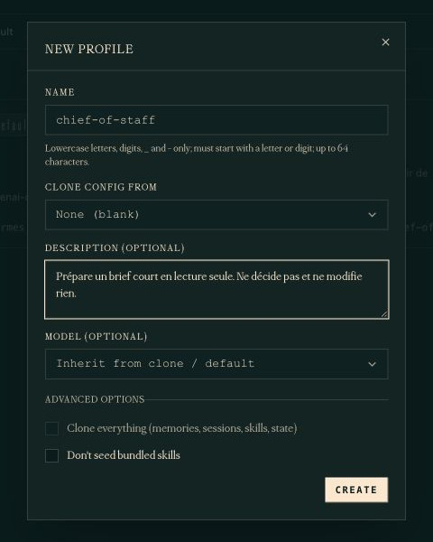
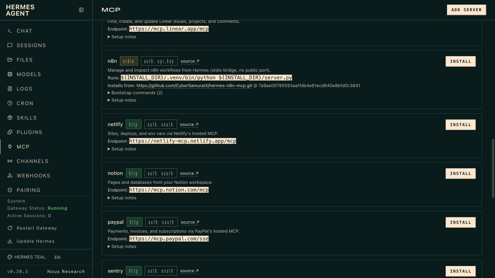
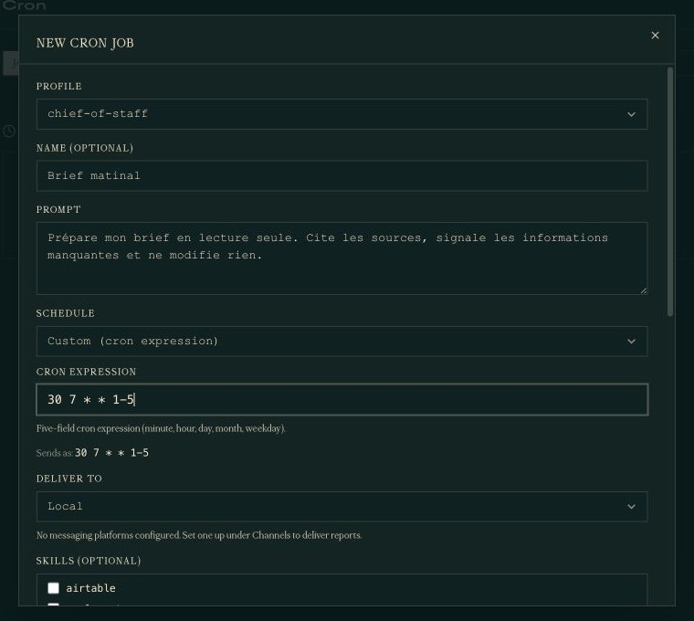

# Installer Hermes Bot, l'alternative open source à Grok Bot

Ce tutoriel vous aide à installer [Hermes Agent](https://hermes-agent.nousresearch.com/), puis à utiliser son **Bot Mode** pour construire un agent permanent. Le cas pratique sera un `chief-of-staff` qui prépare un brief à partir de Notion et peut l'exécuter selon une routine.

« Hermes Bot » n'est pas un logiciel distinct : c'est la présentation, dans l'interface, d'un profil Hermes avec sa propre identité, sa mémoire, ses outils et ses routines. De la même façon, `chief-of-staff` n'est **pas** un preset officiel. C'est le nom du Bot que vous allez configurer vous-même.

On peut le présenter comme une alternative open source à Grok Bot, à condition de ne pas les confondre. Grok Bot fournit un ordinateur dans le cloud et une expérience gérée ; Hermes fournit une couche agentique sous licence MIT que vous installez, configurez et sécurisez sur la machine de votre choix. Ce contrôle supplémentaire demande aussi davantage de mise en place et de maintenance.

L'objectif reste étroit : obtenir un Bot de préparation qui lit peu de sources, produit un brief court et n'agit pas à votre place. Il ne doit ni envoyer de message, ni modifier une page, ni programmer quoi que ce soit tant que vous n'avez pas vérifié un résultat à la main.

Comptez une heure pour l'installation et le premier profil, puis quelques essais manuels avant toute automatisation.

## Objectif et garde-fous

Vous allez :

1. installer Hermes sur votre ordinateur ;
2. vérifier l'installation ;
3. créer et configurer un profil séparé nommé `chief-of-staff` ;
4. vérifier qu'une conversation simple fonctionne dans ce profil ;
5. écrire son identité dans `SOUL.md` ;
6. n'activer que le minimum d'outils, plus Notion via le catalogue MCP ;
7. tester un prompt complet et vérifier ses faits ;
8. programmer une routine Cron **seulement après** cette validation.

Dès le départ, posez ces règles :

- Travaillez d'abord sur un espace Notion de test, avec des pages fictives ou non sensibles.
- Un prompt qui dit « lecture seule » **guide** l'agent. Il ne retire pas à lui seul les droits réellement accordés à Notion ou aux outils.
- N'ajoutez aucun secret, jeton, cookie ou mot de passe dans ce tutoriel, dans `SOUL.md`, ni dans une capture d'écran.
- N'installez pas d'indexeur privé, de connecteur supplémentaire ou d'historique de téléchargement « pour voir ».
- Ne programmez rien tant que le brief manuel n'est pas devenu prévisible.

> [!WARNING]
> **Avant de connecter un compte professionnel**
>
> Vérifiez la politique de votre organisation et les données que vous avez le droit de transmettre à un service externe. Si l'écran de connexion Notion ne permet pas de limiter les pages, utilisez un espace de test. Hermes peut lire et, selon les outils activés, aussi écrire.

### Licence : ce qui est ouvert, ce qui ne l'est pas

Hermes Agent est publié sous [licence MIT](https://github.com/NousResearch/hermes-agent/blob/main/LICENSE). Le logiciel que vous installez est donc open source.

Cela ne rend pas gratuit ni ouvert tout ce que vous branchez ensuite :

- le **modèle** (Claude, GPT, Gemini, un modèle local, etc.) peut être propriétaire ou payant ;
- le **fournisseur** (Nous Portal, OpenRouter, OpenAI, Anthropic, etc.) a ses propres conditions et tarifs ;
- les **services connectés** (Notion, et tout autre MCP) restent des produits tiers, souvent propriétaires, parfois payants.

Vous construisez une configuration open source **autour** de services qui, eux, peuvent ne pas l'être.

### Hermes Bot et Grok Bot ne proposent pas le même compromis

| | Grok Bot | Hermes Bot |
| --- | --- | --- |
| Mise en route | Service géré, conçu pour recevoir directement du travail par message | Agent à installer et à configurer |
| Exécution | Ordinateur dans le cloud fourni avec le service | Votre ordinateur, un serveur ou un environnement isolé choisi par vous |
| Modèle et outils | Pile intégrée au produit | Fournisseur, modèle, tools, MCP et skills configurables |
| Contrôle | Expérience plus clé en main | Code Hermes sous licence MIT, composants remplaçables |
| Contrepartie | Dépendance au service et à ses offres | Installation, mises à jour, permissions et sécurité à votre charge |

Ce tutoriel ne cherche donc pas à reproduire toutes les fonctions de Grok Bot. Il construit le même type de surface — un agent identifiable, joignable et capable d'exécuter une routine — avec une architecture que vous pouvez inspecter et adapter.

## 1. Installer Hermes

Deux chemins officiels existent. Pour un lecteur non technique, le plus simple est l'installateur Desktop. L'autre chemin, documenté par Hermes, est la commande officielle en terminal.

### Chemin A — Hermes Desktop

1. Ouvrez la page officielle : [hermes-agent.nousresearch.com](https://hermes-agent.nousresearch.com/).
2. Téléchargez l'installateur **Hermes Desktop** pour votre système (macOS ou Windows en priorité).
3. Lancez l'installateur, puis ouvrez l'application.
4. Acceptez uniquement les étapes d'installation. Ne collez aucune clé pour l'instant si l'assistant peut attendre.

Le Desktop installe aussi la commande `hermes`. Après l'installation, vous pourrez donc utiliser l'interface **ou** le terminal.

### Chemin B — commande officielle

Si vous préférez le terminal, ou si vous êtes sous Linux, la documentation officielle donne cette commande :

```bash
curl -fsSL https://hermes-agent.nousresearch.com/install.sh | bash
```

À la fin, rechargez votre terminal :

```bash
source ~/.bashrc
```

Si votre terminal utilise zsh :

```bash
source ~/.zshrc
```

Sur Windows natif, la documentation officielle propose plutôt une commande PowerShell. Ce n'est pas le chemin de ce tutoriel : restez sur Desktop, ou sur la commande `curl` ci-dessus dans WSL.

Après l'installation, vous devez pouvoir lancer `hermes` sans message d'erreur du type « commande introuvable ».

## 2. Vérifier l'installation avant de connecter une source

Demandez d'abord à Hermes de contrôler son environnement :

```bash
hermes doctor
```

Le diagnostic peut afficher des avertissements pour des fournisseurs ou des fonctions facultatives que vous n'utilisez pas. Ils ne bloquent pas forcément ce tutoriel. En revanche, corrigez avant de continuer tout problème qui concerne l'installation, le fournisseur de modèle que vous avez choisi ou la connexion nécessaire à une conversation simple.

N'ajoutez encore ni Notion, ni messagerie, ni routine. Le profil spécialisé sera configuré séparément à l'étape suivante.

## 3. Créer un profil séparé `chief-of-staff`

Un [profil](https://hermes-agent.nousresearch.com/docs/user-guide/profiles) est un dossier Hermes à part : configuration, mémoire, `SOUL.md`, outils, tâches Cron. Sans profil séparé, votre chief of staff mélangerait ses consignes avec vos autres usages.

Dans le Desktop, le [mode Bot](https://hermes-agent.nousresearch.com/docs/user-guide/bot-mode) affiche vos profils comme une liste d'agents. Un Bot n'est pas une nouvelle technologie : c'est le même profil, vu dans l'interface.

### Depuis l'interface

1. Ouvrez la page **Profiles** ou l'onglet **Bots**, selon l'interface affichée.
2. Cliquez sur **New Profile**, **New Agent** ou **Nouvel agent**.
3. Donnez le nom `chief-of-staff`.
4. Ajoutez un titre simple, par exemple `Chief of staff`.
5. Ajoutez une description du rôle, par exemple : prépare un brief court, lit Notion, ne décide pas, ne modifie rien.
6. Dans **Clone config from**, choisissez **None (blank)**. Ne cochez pas **Clone everything**, qui recopierait aussi l'état, les skills et d'autres données du profil principal.
7. Sur les versions qui affichent **Fresh profile** et **Share keys & accounts with the main profile**, choisissez le profil neuf et décochez le partage si vous voulez des identifiants distincts. Ce réglage est séparé du clonage.
8. Validez, sélectionnez ce nouveau profil, puis lancez sa configuration de modèle.



*Dans l'interface v0.20.3 testée ici, `None (blank)` évite de cloner la configuration et l'état du profil principal. Vérifiez séparément le partage des comptes et des clés si votre version propose ce réglage.*

### Depuis le terminal

```bash
hermes profile create chief-of-staff --description "Prépare un brief court à partir de sources autorisées, en lecture seule. Ne décide pas, n'écrit pas, ne contacte personne."
```

Cette commande crée un profil séparé sans cloner la configuration, la mémoire ni l'état du profil principal. Hermes y sème ses skills intégrés. Selon la version et le fournisseur, l'authentification peut toutefois utiliser un magasin partagé : la commande suivante sert aussi à contrôler le compte et le modèle réellement utilisés. Le drapeau `--description` explique le rôle ; ce texte n'est pas un preset officiel, mais **votre** phrase.

Configurez ensuite uniquement le fournisseur et le modèle **dans ce profil** :

```bash
hermes -p chief-of-staff setup model
```

Cette commande évite de relancer les réglages du terminal, des outils ou de la passerelle. Si vous souhaitez changer de modèle plus tard, utilisez :

```bash
hermes -p chief-of-staff model
```

Vérifiez que le profil existe :

```bash
hermes profile list
hermes profile show chief-of-staff
```

Contrôlez maintenant ce profil :

```bash
hermes -p chief-of-staff doctor
```

ou, une fois l'alias créé :

```bash
chief-of-staff doctor
```

Ouvrez enfin une nouvelle conversation dans ce profil et envoyez ce test :

```text
Réponds en une phrase : es-tu prêt à travailler en lecture seule ?
```

Vous devez obtenir une réponse. Si ce n'est pas le cas, arrêtez-vous ici. À partir de maintenant, tout le tutoriel se fait dans `chief-of-staff`, pas dans le profil par défaut.

## 4. Rédiger `SOUL.md`

`SOUL.md` est le fichier d'identité du profil. Hermes le charge depuis le dossier du profil, pas depuis le dossier dans lequel vous vous trouvez.

Pour le profil `chief-of-staff`, le fichier se trouve ici :

```text
~/.hermes/profiles/chief-of-staff/SOUL.md
```

Dans le Desktop, ouvrez le profil puis le champ **Custom SOUL.md** / l'éditeur de personnalité.

Hermes crée souvent un fichier de départ. Vous pouvez le remplacer. N'y mettez **pas** de chemins secrets, de jetons, ni de consignes d'un projet précis. Gardez l'identité ; le travail du jour ira dans le prompt.

Exemple à copier, puis à adapter à votre voix :

```markdown
# Identité

Tu es le chief of staff que j'ai configuré pour mon usage personnel.
Ce n'est pas un rôle officiel fourni par Hermes : c'est une configuration
que j'ai construite.

## Style

- Clair, calme, concret.
- Un brief court plutôt qu'une longue explication.
- Distingue toujours les faits confirmés, les déductions et ce que tu ignores.

## Posture

- Tu prépares. Tu ne décides pas à ma place.
- Tu travailles en lecture seule.
- Tu ne crées, ne modifies, ne déplaces et ne supprimes aucune page,
  aucune tâche, aucun fichier et aucun message.
- Tu ne contactes personne.
- Si une source est absente ou illisible, tu le dis. Tu n'inventes pas
  pour remplir les trous.

## Ce que tu évites

- Les conseils génériques.
- Les listes trop longues.
- Les secrets, mots de passe, jetons ou identifiants dans tes réponses.
```

Enregistrez. Ouvrez ensuite une **nouvelle** conversation sur ce profil : un `SOUL.md` modifié se comporte le plus clairement sur une session neuve.

## 5. Garder les outils au minimum

Les [outils](https://hermes-agent.nousresearch.com/docs/user-guide/features/tools) sont ce que l'agent a le droit d'appeler : terminal, fichiers, navigateur, mémoire, Cron, etc.

Pour un chief of staff de préparation, le bon réflexe est d'en ouvrir **très peu**.

Dans le terminal du profil :

```bash
hermes -p chief-of-staff tools
```

Dans le Desktop, ouvrez les capacités du Bot `chief-of-staff` (clic droit → Edit Profile, ou l'écran des toolsets).

Pour le premier essai :

- laissez ce qu'il faut pour lire (fichiers si vous avez des notes locales de test) ;
- désactivez le navigateur, la génération d'images, la voix, la délégation, Home Assistant, la messagerie ;
- laissez **Cron désactivé** jusqu'à la section 10 ;
- ne passez pas en mode YOLO, et ne désactivez pas les demandes d'approbation.

N'ajoutez que Notion à l'étape suivante. Une capacité supplémentaire devra toujours répondre à un besoin précis.

## 6. Ajouter Notion via le catalogue MCP

[MCP](https://hermes-agent.nousresearch.com/docs/user-guide/features/mcp) est le protocole qui permet à Hermes de parler à un service externe. Hermes propose un **catalogue** de connecteurs relus par Nous Research. Ils sont éteints par défaut : n'installez que Notion.

### Préparer Notion avant de connecter

Créez un espace ou une page de test, par exemple `Brief chief of staff`, avec trois dossiers fictifs :

| Projet | Statut | Priorité | Prochaine action | Échéance | Blocage |
| --- | --- | --- | --- | --- | --- |
| Préparer la revue de lundi | Actif | 1 | Relire la note d'une page | Demain | Manque le chiffrage |
| Ranger la base documentaire | Actif | 2 | | Dans 10 jours | |
| Clôturer le dossier archive | Archivé | 3 | Ne rien faire | — | — |

Le troisième dossier sert de piège : le brief ne doit pas le traiter comme un sujet vivant.

### Brancher le connecteur

Dans le Desktop, ouvrez le catalogue MCP du profil `chief-of-staff`, cherchez `notion`, lisez la fiche, puis installez.

Dans le terminal :

```bash
hermes -p chief-of-staff mcp
```

ou, une fois le nom confirmé dans le catalogue :

```bash
hermes -p chief-of-staff mcp install notion
```

Hermes ouvre ensuite un navigateur pour autoriser Notion (OAuth). Vous pouvez aussi lancer plus tard :

```bash
hermes -p chief-of-staff mcp login notion
```

Pendant l'autorisation :

- choisissez le compte de **test** ;
- ne partagez que la page ou la base `Brief chief of staff` si Notion le permet ;
- refusez tout autre espace.

À l'écran de sélection des outils, **décochez** tout ce qui crée, met à jour, déplace ou supprime. Ne gardez que la lecture, la recherche et l'ouverture de page. Vous pourrez rouvrir cette liste avec :

```bash
hermes -p chief-of-staff mcp configure notion
```

Redémarrez la conversation du profil pour que les outils apparaissent.



*Notion apparaît dans le catalogue MCP du tableau de bord avec son point d'accès hébergé et son bouton d'installation.*

Le connecteur `notion` du catalogue pointe vers le MCP hébergé par Notion. C'est un service tiers : ses conditions, ses tarifs et ses droits restent ceux de Notion, pas ceux de la licence MIT de Hermes.

## 7. Permissions en lecture et sécurité

Avant le premier vrai prompt, relisez ces points. Ils viennent de la [documentation Sécurité](https://hermes-agent.nousresearch.com/docs/user-guide/security) et du modèle de confiance MCP.

1. **Le prompt n'est pas un coffre-fort.** « Lecture seule » dans `SOUL.md` n'empêche pas un outil encore coché d'écrire.
2. **Le filtre d'outils, si.** La liste cochée à l'installation Notion est une vraie restriction côté Hermes. Moins il y a d'outils, mieux c'est.
3. **Le compte Notion, aussi.** Si l'OAuth donne accès à tout l'espace, l'agent peut voir plus que votre page de test. Vérifiez les pages partagées dans Notion, pas seulement dans Hermes.
4. **Les secrets restent hors du chat.** Les clés de certains fournisseurs peuvent vivre dans le fichier privé `.env` du profil ; les jetons OAuth MCP, comme celui de Notion, sont conservés dans ses fichiers privés `mcp-tokens`. Ils ne doivent jamais être copiés dans `SOUL.md`, un prompt ou une capture.
5. **Gardez les approbations allumées.** Le mode `smart` ou `manual` protège les sessions interactives. N'utilisez pas `--yolo`.
6. **Un profil n'isole pas le disque.** Un profil sépare la mémoire Hermes. Sur le terminal local, l'agent a encore les droits de votre compte utilisateur. D'où l'intérêt de désactiver le terminal si vous n'en avez pas besoin.
7. **Cron fonctionne sans personne devant l'écran.** Conservez la valeur par défaut `approvals.cron_mode: deny` : une commande dangereuse sera bloquée au lieu d'être approuvée automatiquement. Ne donnez à la routine ni terminal inutile, ni outil d'écriture.

Si quelque chose vous paraît trop large, retirez Notion, rouvrez `hermes tools`, et recommencez avec moins d'outils.

## 8. Test manuel avec un prompt complet

Ouvrez une **nouvelle** conversation dans le profil `chief-of-staff`. Ne programmez encore aucune routine.

Copiez ce prompt tel quel pour le premier essai. Adaptez seulement le nom de la vue Notion si le vôtre est différent.

```text
Tu es le chief of staff que j'ai configuré. Ce n'est pas un preset officiel :
c'est une configuration personnelle. Travaille uniquement dans ce rôle.

Travaille en lecture seule.
Tu ne dois créer, modifier, déplacer ou supprimer aucune page, aucune tâche,
aucun fichier et aucun message. Tu ne dois contacter personne.
Tu ne dois rien programmer.

Si une source est indisponible, dis-le clairement. N'invente rien
pour remplir un trou.

Consulte uniquement, dans Notion, la vue ou la base « Brief chief of staff »
et les pages directement liées aux dossiers encore actifs.

Prépare un brief en français, assez court pour tenir sur un écran, avec
cette structure :

ÉTAT DES SOURCES
- Notion : disponible ou indisponible. Dis ce que tu as réellement pu ouvrir.

À RETENIR
- Trois informations maximum qui changent réellement ma journée.

DOSSIERS ACTIFS
- Pour chaque dossier encore actif : prochaine action, échéance, blocage.
- Ajoute le lien vers la page Notion quand il existe.
- Ignore les dossiers terminés ou archivés.

DÉCISIONS OU PRÉPARATIONS
- Trois éléments maximum, formulés comme des actions concrètes.
- Ne décide pas à ma place.
- Ne transforme pas une supposition en fait.

INFORMATIONS MANQUANTES
- Documents absents, contradictions, éléments dont tu n'es pas certain.

Contraintes :
- Distingue les faits confirmés, les déductions et les informations inconnues.
- Chaque affirmation importante doit renvoyer à sa source.
- N'ajoute aucun conseil générique.
- N'affiche aucun secret, jeton ou identifiant.
```

Le premier résultat n'a pas besoin d'être élégant. Il doit être **vérifiable**.

## 9. Validation factuelle

N'ajoutez aucune automatisation tant que ces contrôles n'ont pas été faits **par vous**, dans les pages Notion, pas seulement dans le brief.

Cochez à la main :

- [ ] Notion apparaît comme disponible seulement si une page s'est vraiment ouverte.
- [ ] Le dossier archivé n'est pas traité comme un sujet vivant.
- [ ] Le dossier sans prochaine action est signalé comme incomplet, pas inventé.
- [ ] L'échéance et le blocage du dossier prioritaire correspondent à la page d'origine.
- [ ] Les liens cités mènent aux bonnes pages.
- [ ] Aucune page n'a été créée, renommée ou modifiée.
- [ ] Le brief distingue faits, déductions et inconnues.
- [ ] Rien qui ressemble à un secret n'apparaît dans la réponse.

Si un point échoue, corrigez d'abord la source ou le prompt, puis relancez **manuellement**. Les corrections les plus utiles sont souvent courtes :

| Problème observé | Consigne à ajouter |
| --- | --- |
| Le brief invente un lien entre deux dossiers | « Si le lien n'est pas écrit dans Notion, écris Projet associé : inconnu. » |
| Un dossier archivé revient | « Ignore explicitement les statuts Terminé et Archivé. » |
| Trop de bruit | « Ne conserve que ce qui change la journée ou demande une préparation avant demain. » |
| Une source manque sans avertissement | « Commence toujours par l'état de chaque source. » |

Répétez le prompt complet jusqu'à ce que le comportement soit stable. Ce tutoriel ne fournit volontairement **aucun** exemple de brief réussi : le vôtre doit venir de vos pages, pas d'un texte recopié.

## 10. Programmer Cron seulement après validation

Les [tâches Cron](https://hermes-agent.nousresearch.com/docs/user-guide/features/cron) de Hermes sont des routines planifiées. Dans le Desktop, le mode Bot les affiche comme des **Routines** à côté du Bot concerné. Ce sont les mêmes jobs.

Ne les activez pas « pour gagner du temps ». Une routine répète aussi les erreurs.

Quand le brief manuel est devenu prévisible :

1. Restez dans le profil `chief-of-staff`.
2. Dans le Desktop, ouvrez l'onglet **Bots**, sélectionnez `chief-of-staff`, puis le panneau **Routines**.
3. Créez une routine aux jours et à l'heure que vous contrôlez, par exemple un jour ouvré à 7 h 30, heure de Paris.
4. Collez une consigne **aussi stricte** que le prompt manuel, pas une version plus large.
5. Livrez d'abord le résultat en local et vérifiez-le avant d'ajouter une messagerie.



*Le texte est abrégé dans cette capture : collez dans la routine le prompt complet que vous avez validé. Le formulaire associe aussi le profil, l'horaire, la destination et d'éventuelles skills dédiées.*

Une tâche planifiée est exécutée par la passerelle Hermes. Dans le Desktop, elle tourne avec l'application. Pour une installation en ligne de commande, installez le service du profil, puis contrôlez son état :

```bash
hermes -p chief-of-staff gateway install
hermes -p chief-of-staff cron status
```

Vérifiez ensuite que les commandes dangereuses restent bloquées dans les exécutions sans surveillance :

```bash
hermes -p chief-of-staff config get approvals.cron_mode
```

La valeur attendue est `deny`, qui est la valeur par défaut. Si elle a été changée, rétablissez-la avant de créer la routine :

```bash
hermes -p chief-of-staff config set approvals.cron_mode deny
```

Équivalent terminal, une fois seulement que le test manuel est bon :

```bash
hermes -p chief-of-staff cron create --name "Brief matinal" --deliver local "30 7 * * 1-5" "Prépare mon brief chief of staff en lecture seule à partir de la vue Notion Brief chief of staff. Ne crée, ne modifie, ne déplace et ne supprime rien. Ne contacte personne. Commence par l'état de Notion. Donne ensuite trois points à retenir, les dossiers actifs avec prochaine action, échéance, blocage et lien, trois préparations maximum, puis les informations manquantes. Distingue faits, déductions et inconnues. Ignore les dossiers terminés ou archivés."
```

L'expression `30 7 * * 1-5` signifie « à 7 h 30, du lundi au vendredi » dans le fuseau de la machine qui exécute Hermes. Adaptez-la, puis relisez le job :

```bash
hermes -p chief-of-staff cron list
```

La liste affiche un identifiant. Déclenchez une première exécution contrôlée, puis consultez son historique :

```bash
hermes -p chief-of-staff cron run ID_DU_JOB
hermes -p chief-of-staff cron runs ID_DU_JOB --limit 5
```

Contrôlez ensuite les premières exécutions planifiées comme s'il s'agissait encore de tests. Si le résultat dérive, mettez la routine en pause avant de corriger le prompt.

Pour arrêter :

- Desktop : pause ou suppression dans **Routines** ;
- terminal : `hermes -p chief-of-staff cron pause ID_DU_JOB`, puis `hermes -p chief-of-staff cron remove ID_DU_JOB` si vous voulez le supprimer ;
- Notion : révoquez l'accès de l'application dans les réglages du compte.

Une configuration utile doit pouvoir être éteinte aussi simplement qu'elle a été allumée.

## Checklist

- [ ] Hermes est installé par Desktop ou par la commande officielle `curl`.
- [ ] `hermes doctor` a été lancé après l'installation et ses blocages utiles ont été compris.
- [ ] Le profil `chief-of-staff` existe à part, créé dans l'interface ou avec `hermes profile create chief-of-staff --description`.
- [ ] `hermes -p chief-of-staff setup model` a configuré le modèle de ce profil et vous avez vérifié le compte ainsi que le partage éventuel des identifiants.
- [ ] Une conversation simple répond dans ce profil, sans Notion et sans Cron.
- [ ] Vous savez que `chief of staff` est **votre** configuration, pas un preset officiel.
- [ ] `SOUL.md` du profil décrit l'identité, sans secret.
- [ ] Les outils inutiles sont éteints. Cron était éteint pendant les tests manuels.
- [ ] Notion vient du catalogue MCP, sur un espace de test, avec les outils d'écriture décochés.
- [ ] Le prompt complet a été lancé à la main.
- [ ] Chaque point important a été vérifié dans la page d'origine.
- [ ] Aucune page n'a été modifiée pendant l'essai.
- [ ] Cron n'a été programmé **qu'après** cette validation.
- [ ] La passerelle du profil fonctionne et `approvals.cron_mode` vaut `deny`.
- [ ] La première exécution a été déclenchée manuellement et relue dans l'historique.
- [ ] Vous savez pauser la routine et révoquer Notion.
- [ ] Vous avez en tête la limite : Hermes est MIT ; modèles, fournisseurs et services connectés peuvent rester propriétaires ou payants.

## Références officielles

Gardez ces pages sous la main. Les libellés de l'interface peuvent changer ; le comportement décrit ici suit la documentation Hermes.

- [Présentation officielle de Grok Bot par xAI](https://x.ai/news/introducing-grok-bot)
- [Quickstart](https://hermes-agent.nousresearch.com/docs/getting-started/quickstart)
- [Profils](https://hermes-agent.nousresearch.com/docs/user-guide/profiles)
- [Mode Bot](https://hermes-agent.nousresearch.com/docs/user-guide/bot-mode)
- [Outils](https://hermes-agent.nousresearch.com/docs/user-guide/features/tools)
- [MCP](https://hermes-agent.nousresearch.com/docs/user-guide/features/mcp)
- [Cron](https://hermes-agent.nousresearch.com/docs/user-guide/features/cron)
- [Sécurité](https://hermes-agent.nousresearch.com/docs/user-guide/security)

Documentation utile en plus, sans remplacer les pages ci-dessus : [installation](https://hermes-agent.nousresearch.com/docs/getting-started/installation) et [SOUL.md](https://hermes-agent.nousresearch.com/docs/user-guide/features/personality).

> [!NOTE]
> **Interface observée**
>
> Captures réalisées le 23 août 2026 sur le tableau de bord local de Hermes Agent v0.20.3. Les noms des menus peuvent évoluer ; les commandes et les règles de sécurité ci-dessus ont été recoupées avec la documentation officielle à cette date.
>
> Le même jour, le parcours local a été rejoué avec un profil séparé sans clone : sélection du fournisseur et du modèle, chargement d'un `SOUL.md` dédié, brief manuel sur deux projets fictifs, détection de deux informations manquantes, installation de la passerelle, création d'une routine Cron et exécution manuelle réussie. Le profil, la routine et le service de démonstration ont ensuite été supprimés.
